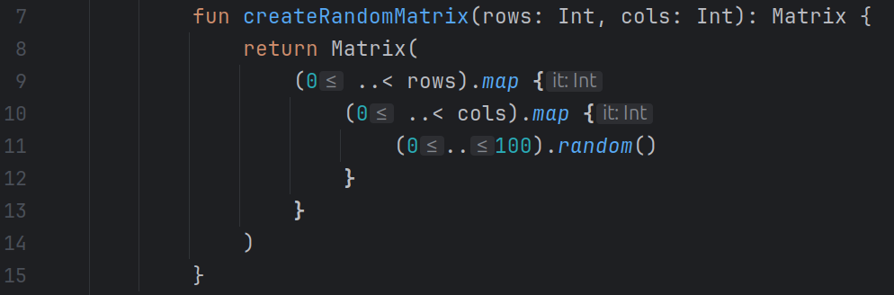
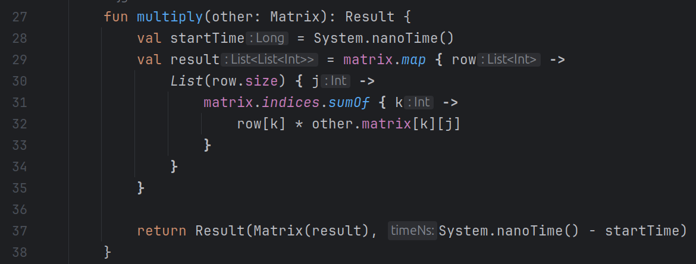
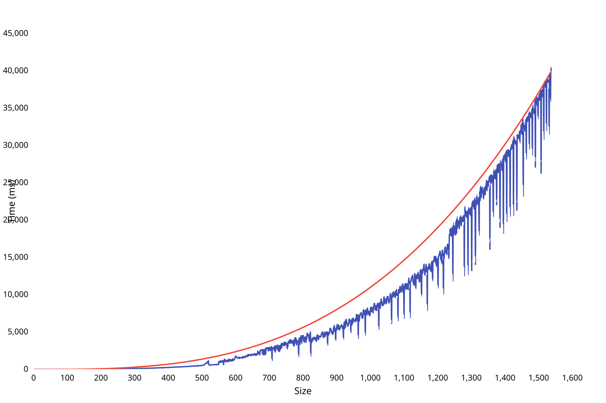
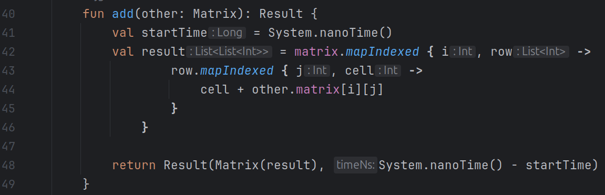
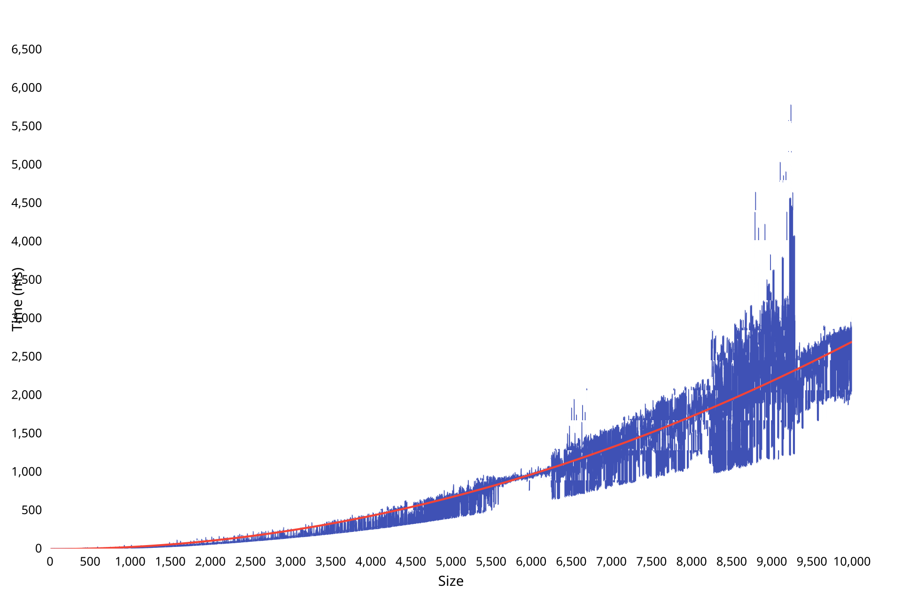
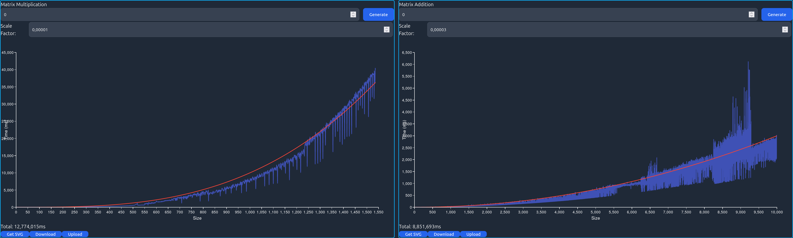

# Matrix Calculating
## Requirements
- Java 17
- Node 20

## How to run
1. Clone the repository
2. Build the client
```bash
./gradlew copyStaticResources
```
3. Run the server
```bash
./gradlew bootRun
```
4. Open the browser and go to `http://localhost:8080`
5. Enjoy!

## How to Build Jar
```bash
./gradlew bootJar
```

## Runtime Analysis Matrix Generation


| Code                   | Cost    | Quantity |
|------------------------|---------|----------|
| ``return Matrix(``     | C1      | 1        |
| ``(0 ..< rows).map {`` | C1 + C2 | n        |
| ``(0 ..< cols).map {`` | C1 + C2 | n * n    |
| ``random.nextInt()``   | C3      | n * n    |
T(n) = C1 + n(C1 + C2) + n^2(C1 + C2) + n^2(C3)

### Instruction Table (Made up)
| Instruction | Name | Time |
|-------------|------|------|
| Assign      | C1   | 1    |
| Compare     | C2   | 1.2  |
| Random      | C3   | 1.5  |

T(n) = 1 + n(1 + 1.2) + n^2(1 + 1.2) + n^2(1.5) <br>
T(n) = 1 + 2.2n + 2.2n^2 + 1.5n^2 <br>
T(n) = 1 + 2.2n + 3.7n^2

## Runtime Analysis Matrix Multiplication


### Table

| Code                                  | Cost         | Quantity  |
|---------------------------------------|--------------|-----------|
| ``val startTime = System.nanoTime()`` | C1           | 1         |
| ``val result = matrix.map { row ->``  | C1 + C2 + C1 | n         |
| ``List(row.size) { j ->``             | C1 + C3 + C1 | n * n     |
| ``matrix.indices.sumOf { k ->``       | C1 + C4 + C1 | n * n * n |
| ``row[k] * matrix[k][j]``             | C5           | n * n * n |
T(n) = C1 + n(C1 + C2 + C1) + n^2(C1 + C3 + C1) + n^3(C1 + C4 + C1) + n^3(C5)

### Instruction Table (Made up)
| Instruction | Name | Time |
|-------------|------|------|
| Assign      | C1   | 1    |
| Compare     | C2   | 1.2  |
| Size        | C3   | 1.5  |
| SumOf       | C4   | 1.5  |
| Multiply    | C5   | 2    |

T(n) = 1 + n(1 + 1.2 + 1) + n^2(1 + 1.5 + 1) + n^3(1 + 1.5 + 1) + n^3(2) <br>
T(n) = 1 + 3.2n + 3.5n^2 + 3.5n^3 + 2n^3 <br>
T(n) = 1 + 3.2n + 3.5n^2 + 5.5n^3

### Graph

<svg scr="./img/matrixMultiplication.svg>

[Sample File](./sampleData/matrixMultiplication.json)

## Runtime Analysis Matrix Addition


### Table

| Code                                           | Cost              | Quantity  |
|------------------------------------------------|-------------------|-----------|
| ``val startTime = System.nanoTime()``          | C1                | 1         |
| ``val result = matrix.mapIndexed { i, row ->`` | C1 + C2 + C1 + C1 | n         |
| ``row.mapIndexed { j, cell ->``                | C1 + C2 + C1 + C1 | n * n     |
| ``cell + other.matrix[i][j]``                  | C3                | n * n     |
T(n) = C1 + n(C1 + C2 + C1 + C1) + n^2(C1 + C2 + C1 + C1) + n^2(C3)

### Instruction Table (Made up)
| Instruction | Name | Time |
|-------------|------|------|
| Assign      | C1   | 1    |
| Compare     | C2   | 1.2  |
| Add         | C3   | 1.5  |

T(n) = 1 + n(1 + 1.2 + 1 + 1) + n^2(1 + 1.2 + 1 + 1) + n^2(1.5) <br>
T(n) = 1 + 4.2n + 4n^2 + 1.5n^2 <br>
T(n) = 1 + 4.2n + 5.5n^2


### Graph

<svg scr="./img/matrixAddition.svg">

[Sample File](./sampleData/matrixAddition.json)

## Web Interface



